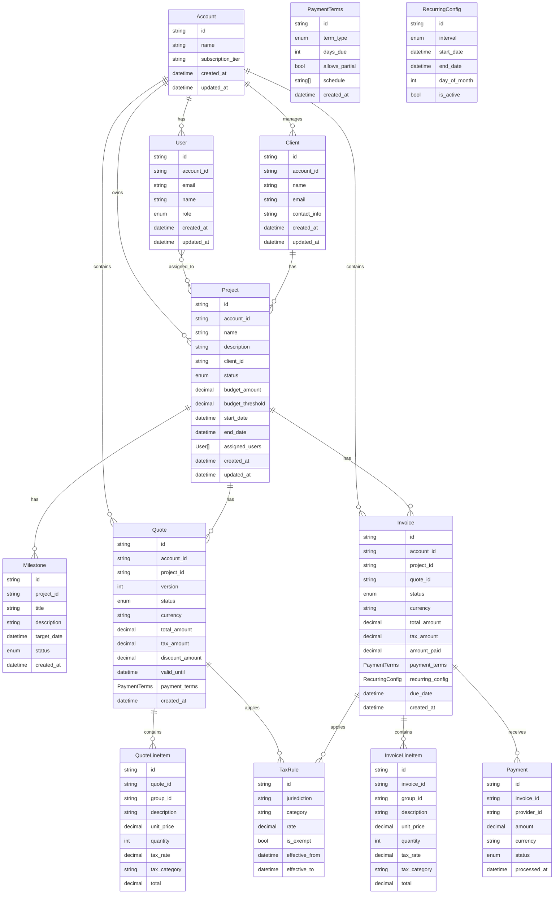
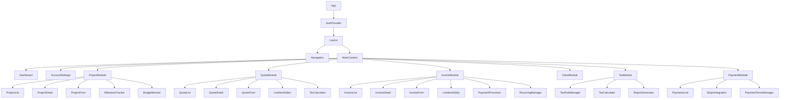
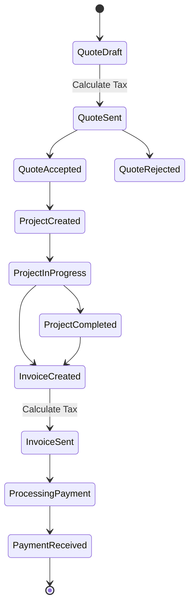
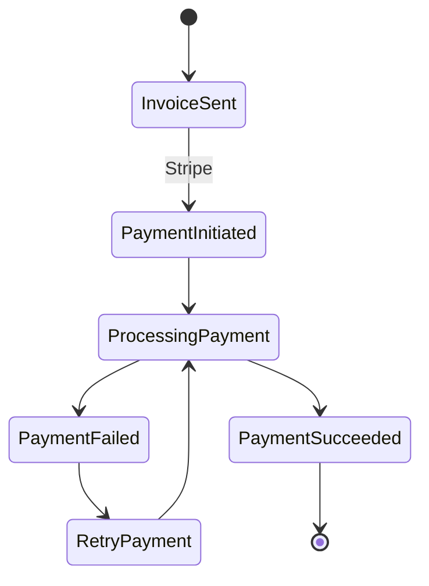

# Project Management Application Architecture

## Data Model

### Core Entities



### Entity Relationships
- Account is the top-level entity for multi-tenant separation
- All major entities belong to an Account
- Projects now include budget tracking and milestones
- Quotes and Invoices support multiple currencies and tax rules
- Payment terms can be customized and inherited
- Tax rules support location-based calculations and exemptions
- Simple recurring invoice configuration
- Payments track Stripe integration with extensibility

## Component Architecture



### Reusable Components
- LineItemEditor: Used in both quotes and invoices
- TaxCalculator: Shared tax computation logic
- PaymentProcessor: Abstract payment handling
- StatusBadge: Display status across entities
- AlertManager: Simple in-app notifications
- FilterPanel: Reusable filtering interface
- TableComponent: Sortable, filterable data table

### State Management
- React Context for:
  - Authentication state
  - Current account context
  - User preferences
  - Alert notifications
  - Global UI state
- React Query for:
  - Data fetching and caching
  - Server state management
  - Real-time updates
- Local component state for UI-specific state

## System Flows

### Quote to Project to Invoice Flow



### Payment Processing Flow



## API Endpoints

### Project Management
- GET /api/projects
- GET /api/projects/:id
- POST /api/projects
- PUT /api/projects/:id
- GET /api/projects/:id/milestones
- POST /api/projects/:id/milestones
- PUT /api/projects/:id/milestones/:milestoneId

### Financial Management
- GET /api/quotes
- POST /api/quotes
- PUT /api/quotes/:id
- POST /api/quotes/:id/calculate-tax
- GET /api/invoices
- POST /api/invoices
- PUT /api/invoices/:id
- POST /api/invoices/:id/calculate-tax
- POST /api/invoices/:id/payments
- GET /api/payments
- GET /api/payment-terms
- POST /api/payment-terms

### Tax Management
- GET /api/tax-rules
- POST /api/tax-rules
- PUT /api/tax-rules/:id
- GET /api/tax-reports/monthly
- GET /api/tax-reports/quarterly
- POST /api/tax-reports/export

### Budget and Alerts
- GET /api/projects/:id/budget
- POST /api/projects/:id/budget/threshold
- GET /api/alerts

## Data Export/Import

### Export Format
```json
{
  "metadata": {
    "version": "1.0",
    "export_date": "ISO-8601 timestamp",
    "account_id": "string"
  },
  "data": {
    "clients": [...],
    "projects": [...],
    "quotes": [...],
    "invoices": [...],
    "payments": [...],
    "tax_rules": [...]
  }
}
```

### Export Types
1. Full Account Export
   - All account data
   - Tax rules and history
   - Payment records
2. Financial Reports
   - Monthly/Quarterly tax reports
   - Payment summaries
   - Budget reports

All API endpoints automatically scope data to the current account context based on the authenticated user's account_id.