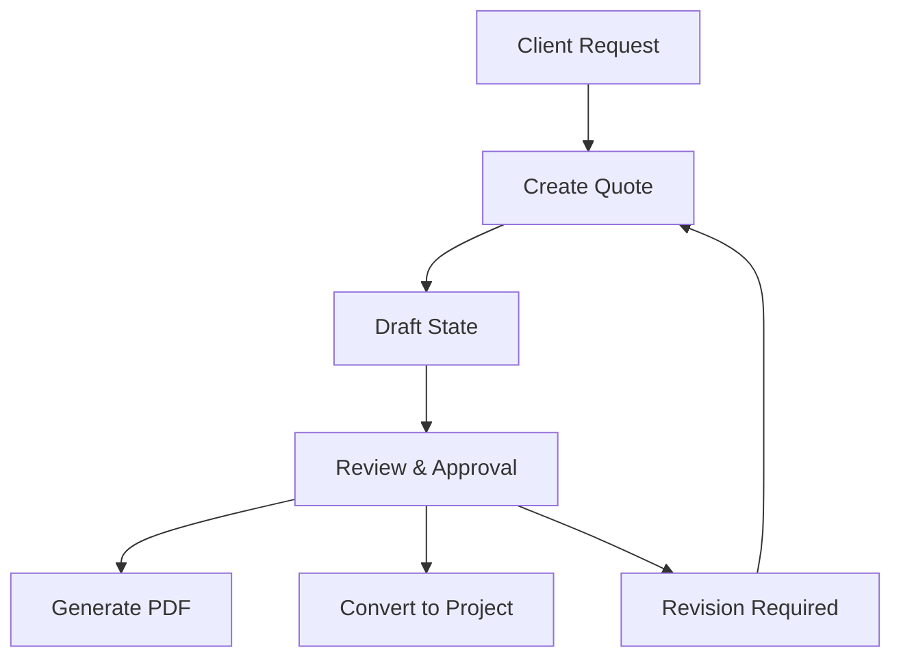
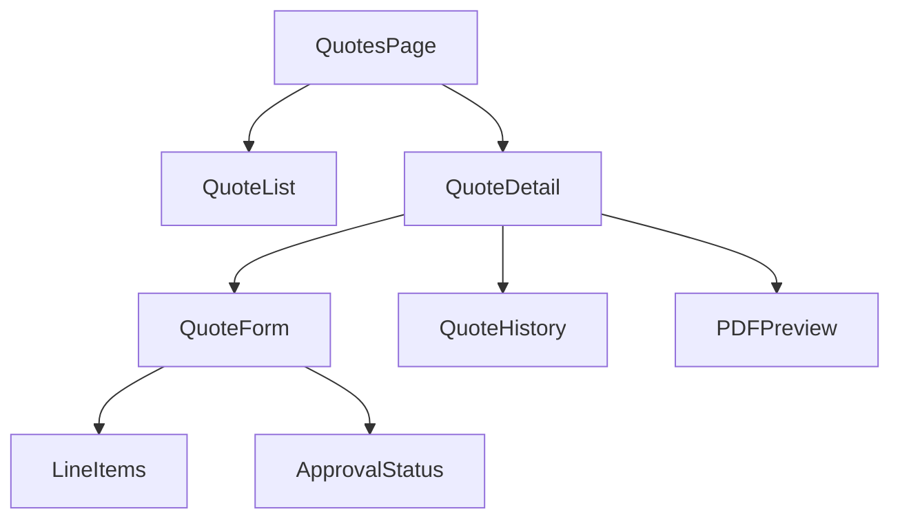
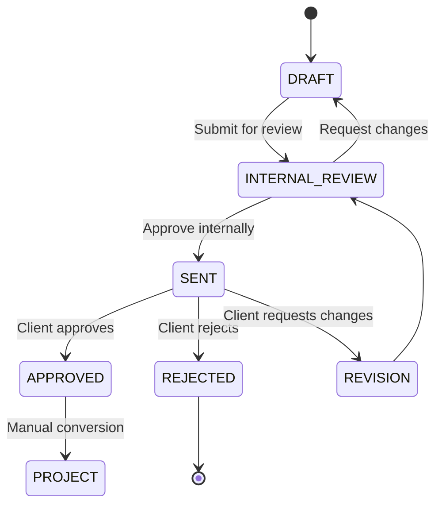

# Quote System Technical Specification

## Overview



## Data Models

### Quote Model
```prisma
model Quote {
    id          Int      @id @default(autoincrement())
    number      String   @unique
    version     Int      @default(1)
    status      String   // DRAFT, INTERNAL_REVIEW, SENT, APPROVED, REJECTED
    templateType String  // Type of quote template to use
    clientId    Int
    client      Client   @relation(fields: [clientId], references: [id])
    projectId   Int?
    project     Project? @relation(fields: [projectId], references: [id])
    items       QuoteItem[]
    subtotal    Float
    tax         Float
    total       Float
    validUntil  DateTime
    notes       String?
    createdAt   DateTime @default(now())
    updatedAt   DateTime @updatedAt
    createdBy   Int
    user        User     @relation(fields: [createdBy], references: [id])
    history     QuoteHistory[]

    @@index([clientId])
    @@index([projectId])
    @@index([createdBy])
}

model QuoteItem {
    id          Int      @id @default(autoincrement())
    quoteId     Int
    quote       Quote    @relation(fields: [quoteId], references: [id])
    description String
    quantity    Float
    unitPrice   Float
    total       Float
    taxable     Boolean  @default(true)
    sortOrder   Int

    @@index([quoteId])
}

model QuoteHistory {
    id          Int      @id @default(autoincrement())
    quoteId     Int
    quote       Quote    @relation(fields: [quoteId], references: [id])
    version     Int
    changes     Json     // Store changes made in this version
    createdAt   DateTime @default(now())
    createdBy   Int
    user        User     @relation(fields: [createdBy], references: [id])

    @@index([quoteId])
    @@index([createdBy])
}
```

## API Endpoints

### Quotes
- `GET /api/quotes` - List quotes with filtering & pagination
- `GET /api/quotes/:id` - Get quote details
- `POST /api/quotes` - Create new quote
- `PUT /api/quotes/:id` - Update quote
- `POST /api/quotes/:id/send` - Send quote to client
- `POST /api/quotes/:id/approve` - Approve quote
- `POST /api/quotes/:id/reject` - Reject quote
- `POST /api/quotes/:id/revise` - Create new version
- `GET /api/quotes/:id/history` - Get version history
- `GET /api/quotes/:id/pdf` - Generate PDF

## Frontend Component Hierarchy



## State Management

### Quote Status Flow


## Business Rules

1. Version Control
   - Each quote starts at version 1
   - New versions increment the version number
   - All versions are preserved in history
   - Changes are tracked in QuoteHistory

2. Template Management
   - Support multiple quote templates
   - Templates defined by work type
   - Custom fields per template type
   - Template selection required at creation

3. Approval Workflow
   - Internal review required before sending to client
   - Reviewers can request changes or approve
   - Only internally approved quotes can be sent to clients
   - Approved quotes can be manually converted to projects
   - Rejected quotes require a reason
   - New versions can be created from any status

3. Calculations
   - Line item totals = quantity * unitPrice
   - Subtotal = sum of line item totals
   - Tax calculated based on taxable items only
   - Total = subtotal + tax

4. Security
   - Users can only access quotes they created or are assigned to
   - Only quote creator can change status to SENT
   - Client approval requires secure link